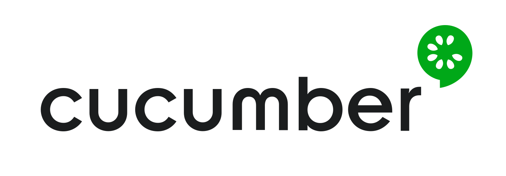

# 

# Prueba automatizada con serenity js para validar el inicio de sesión en facebook

# 

## Framework

* Serenity: Se utiliza como framework Serenity BDD, que utiliza los resultados de las pruebas para realizar la documentación describiendo lo que hace la aplicación, informa que pruebas se han realizado, las pruebas que fallaron y las que pasaron. 

## Patron de desarrollo

* Se utiliza Screenplay pattern ya que esta centrado en el usuario y orientado a tareas, utiliza los principios S.O.L.I.D. Con screenplay se puede escribir el codigo en un lenguaje mas natural.

## Herramientas de compilación 

# 

### npm

* npm es un administrador de paquetes para el lenguaje de programación JavaScript.

# 

### Cucumber

* Es una herramienta que permite escribir los casos de prueba.

# 
### Typescript
* TypeScript es un lenguaje de programación desarrollado y mantenido por Microsoft. Es un superconjunto sintáctico estricto de JavaScript y agrega escritura estática opcional al lenguaje. TypeScript está diseñado para el desarrollo de aplicaciones grandes y transcompila a JavaScript.

## La estructura completa del proyecto es la siguiente:

* Features: Utiliza lenguaje Gherkin y contienen los escenarios de negocio del caso de prueba. 
* Tasks: Clases que representan tareas que realiza el actor a nivel de proceso de negocio. 
* Builders: Patron que permite crear un objeto de una forma más dinámica.
* Drivers: Clase que permite la conexión con el driver.
* Interfaces: Carpetas donde se crean las clases de tipo interfaz
* Models: Carpeta donde estan las clases de tipo objetos
* Questions: Comprueban los resultados de las operaciones realizadas. 
* Exceptions: Son las excepciones que se visualizan cuando un test falla o tiene errores. 
* Steps: Carpeta donde estan los pasos generados por cucumber
* Ui: Es una clase abstracta que se utiliza para agrupar métodos relacionados con cuerpos vacíos.
* Support: Carepta donde se crea el actor y se inicializa

# Requerimientos

* npm

# Comandos para ejecutar el proyecto.

* npm install
* npm run test

## Autor

Juan Francisco Builes Montoya - juanfranciscobumo@gmail.com
